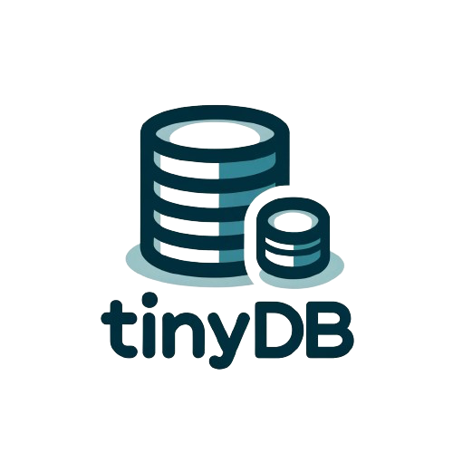

# tinydb

A lightweight log-structured-merge-database (LSM) built for time-series data. The main goal of this library is to learn and implement LSM-trees from scratch.

## Getting started

To use the storage engine...